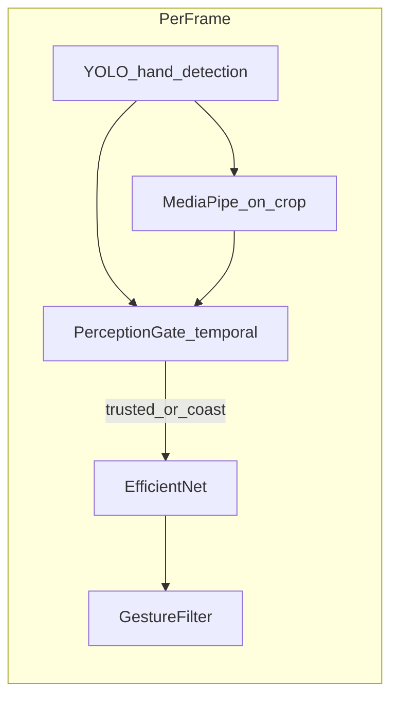

# Perception + Control Gating — Full Design

**Principle:** *YOLO proposes, MediaPipe supports, time decides.*

This document is the design-only deliverable: architecture, critique, revision, and operational rules. Implementation lives in [`../scripts/perception_gating.py`](../scripts/perception_gating.py); optional CLI wiring in `gesture_bridge.py` and `simulate_drone.py`.

---

## TASK 1 — Initial Design

### 1. Architecture

**Per frame (conceptual order):**

1. **YOLO** on downscaled RGB (existing [`hand_detection.detect_hand`](../scripts/hand_detection.py)): proposals + geometry + YuNet face IoU + `BboxSmoother` → **candidate crop** `C` and bbox `B` (or `None`).
2. **MediaPipe HandLandmarker** on **`C` only** (expanded square crop already produced by the pipeline): *support* signal — does this region contain a plausible hand skeleton?
3. **Temporal gate** (`PerceptionGate`): merges YOLO persistence + MP agreement into **`trusted`** / **`coast`** (manual only) before **EfficientNet** sees pixels.
4. **EfficientNet** + **GestureFilter** (unchanged): only consume crops that passed the gate (unless gate disabled).

**Data structures:**

| Name | Role |
|------|------|
| `YoloFrameDiag` | Existing dict: `yolo_n`, `yolo_top_conf`, `reject_stage`, … |
| `MpFrameDiag` | `mp_present` (bool), `mp_hands` (int count) |
| `GateDiag` | `gate_trusted`, `gate_coast`, `mp_agree_streak`, `mp_miss_streak`, `control_mode` |
| `PerceptionGateState` | Internal counters + sticky trust; updated each frame |

**Raw vs trusted:** A **candidate** is any frame where `detect_hand` returns a crop. A **trusted** hand is one where temporal rules say “safe to drive behavior.”

### 2. Manual mode logic

- **Goal:** Responsive control; tolerate MP missing briefly (side angles, wrist occluded).
- **Accept classification crop when:** `trusted == True` OR `coast_remaining > 0` (coast only in manual).
- **Trust creation:** `mp_agree_streak >= N_create_manual` (e.g. 3 consecutive frames where MP finds ≥1 hand in `C`).
- **Coast:** After trust was true, if MP fails but YOLO still supplies a crop, allow **`M_coast_manual`** frames (e.g. 5) of classification without MP — bounded so a stable YOLO false positive cannot run forever without MP ever agreeing.

### 3. Autonomous mode logic

- **Goal:** Drone runs without user; **random YOLO FPs must not** flip modes or issue “interrupt” commands.
- **Differences:** No coast without MP. Higher **`N_create_autonomous`** (e.g. 6). **Drop trust** after fewer consecutive MP misses (`K_drop_auto` e.g. 2).
- **Interrupt autonomy:** Only gestures that are safety-critical (e.g. **fist → STOP**) may break autonomy — require **`interrupt_streak ≥ N_interrupt`** frames where gate is **trusted**, classifier agrees on that gesture, and confidence ≥ threshold. (GestureFilter still applies; this is an *additional* layer for autonomy transitions.)

### 4. MediaPipe integration

- **Where:** **YOLO crop `C`** (RGB, same tensor fed to EfficientNet). Not full frame — keeps cost ~1× HandLandmarker per frame when one hand is proposed; avoids associating multiple hands with YOLO in v1.
- **Signals:** Presence of `hand_landmarks` (non-empty list); optionally require **21** landmarks. Tasks API may not expose per-frame detection score uniformly — **presence = support**.
- **Role:** **Soft support, hard floor:** MP **never alone** drives commands in v1 (YOLO still proposes region). MP **withholds trust** until agreement + time. YOLO-without-MP can still win briefly via **manual coast** only.

### 5. Temporal logic

| Event | Suggested default |
|-------|-------------------|
| Create trusted (manual) | 3 consecutive MP-agree frames |
| Create trusted (autonomous) | 6 consecutive MP-agree frames |
| Maintain (manual) | MP agree resets miss; MP miss starts coast if previously trusted |
| Maintain (autonomous) | MP miss increments; trust cleared after 2 misses |
| Drop trusted | Coast exhausted (manual) or MP miss threshold (autonomous) |

**Temporary MP failure (manual):** Handled by **coast**; if YOLO also drops, gate resets quickly.

### 6. Failure handling

| Situation | Policy |
|-----------|--------|
| YOLO wrong, MP absent in crop | No trust; no classification output (or only after spurious coast depletes). |
| YOLO wrong, MP absent but “looks like” edge case | Rare; MP absent → no trust. |
| YOLO misses real hand | No crop → no fix in v1 (optional future: low-rate full-frame MP to propose ROI — not in minimal implementation). |
| MP misses, YOLO correct (manual) | **Coast** carries short-term classification. |
| Both noisy | Gate stays closed; GestureFilter sees “No hand” / low feed. |

### 7. Performance

- **Cost:** +1× `HandLandmarker.detect` on **crop** (~224–256+ px typical) per frame when YOLO returns a crop — **~30–50% FPS drop** on CPU typical (order-of-magnitude; measure on target hardware).
- **Minimize:** Run MP only if `hand_crop is not None`; keep crop max side capped if needed; optional `gate_stride` (run MP every 2nd frame) — **not** in default minimal impl.

---

## TASK 2 — Critique (Brutal)

1. **YOLO FP stable + MP random noise:** If a face tile occasionally gets 1 spurious MP detection, streak counters could still increment — **rare** but possible. Mitigation: require **IoU overlap** between MP implied bbox (from landmarks) and YOLO box inside crop (normalized) — **v2**.
2. **MP on crop only:** Cannot recover YOLO miss — **inherent** limitation of v1.
3. **Autonomous “interrupt”** without a real autonomy state machine in Python: The bridge only streams gestures; **true** autonomy is ROS-side. The gate’s **autonomous mode** is a **policy preset** for stricter trust — must be aligned with ROS state in a full system.
4. **Coast in manual:** A **persistent** YOLO FP could theoretically coast for `M` frames and emit one bad command — **bounded** but non-zero. Mitigation: small `M`, and require prior MP trust this session.
5. **Complexity:** Two layers (GestureFilter + PerceptionGate) — operators must tune **both**; document defaults clearly.

---

## TASK 3 — Revised Design (Simplifications)

1. **Single MP signal:** Landmark presence in crop; no full-frame MP in v1.
2. **Trust:** Streak-based only; **coast only in manual** with low `M` (5).
3. **Autonomous:** Stricter streak, no coast; **interrupt** logic remains **policy hooks** in gate config (ROS integration later).
4. **Optional IoU sub-check** (future): `mp_landmarks_to_aabb` vs full bbox — skip in first implementation to ship faster.

---

## TASK 4 — Final Deliverable Summary

### 1. FINAL DESIGN (concise)

- **YOLO** proposes region; **MP** validates content of that region; **time** (streaks + manual coast) decides **trusted**.
- **Manual:** faster trust + coast on MP dropout.
- **Autonomous:** slow trust, no coast; stricter drop.

### 2. KEY RULES

- No EfficientNet input unless **`gate_trusted` OR `gate_coast`** (manual only for coast).
- MP runs **only** when YOLO provides a crop **and** perception gate is enabled.
- **Autonomous** mode never uses coast without MP agreement history (implementation: no coast flag in autonomous).
- YuNet face filter in `hand_detection` stays **upstream**; this gate is **downstream** of YOLO crop.
- GestureFilter and `CONFIDENCE_THRESHOLD` apply **after** the gate passes a crop.

### 3. PARAMETERS

See **defaults** in [`perception_gating.py`](../scripts/perception_gating.py) (`PerceptionGateConfig`).

| Parameter | Manual start | Autonomous start | Meaning |
|-----------|--------------|------------------|---------|
| `N_CREATE` | 3 | 6 | Consecutive MP-agree frames to trust |
| `M_COAST` | 5 | 0 | Frames to allow classification without MP after trust (manual only) |
| `K_DROP_AUTO` | — | 2 | Consecutive MP misses to drop trust |
| `MP_MIN_LANDMARKS` | 15 | 15 | Min landmarks to count as agree |

### 4. KNOWN LIMITATIONS

- YOLO **misses** real hands: not fixed without full-frame MP or sensor fusion.
- **Semantic** FP taxonomy (chair vs face) not logged — only MP/YOLO/temporal.
- **Interrupt autonomy** requires ROS-side **mode** integration for production; CLI `autonomous` is a **strict policy preset** on the Windows side.
- **FPS:** MP on crop adds measurable cost; profile on device.

---

## CLI (implementation)

- `gesture_bridge.py` / `simulate_drone.py`: trusted-hand gate is **on by default**; `--no-perception-gate` or `MLX_GESTURE_PERCEPTION_GATE=0` disables it.

Environment variable fallback: `MLX_GESTURE_PERCEPTION_GATE=1`.
